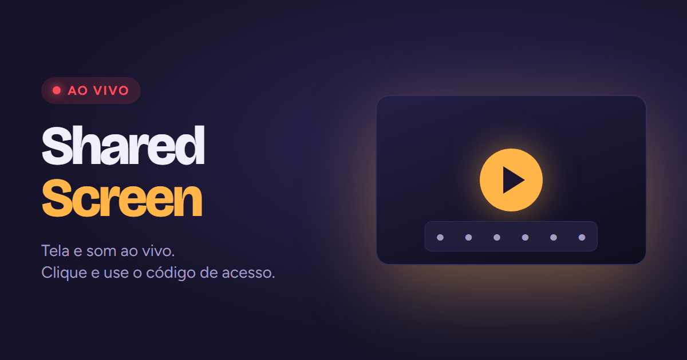

# SharedScreen

Transmita sua tela e o som do PC, ao vivo, para poucas pessoas. Sem instalar nada: é uma página
só, aberta no navegador. Quem assiste só vê e ouve. Não tem microfone, câmera nem chat.

**Abrir:** https://yagoxavier.github.io/SharedScreen/



## Como usar

**Para transmitir**

1. Abra a página no Chrome, no Edge ou no Brave (todos usam o motor do Chrome). No Brave, se não
   conectar, desligue os Shields para este site.
2. Escolha a qualidade e clique em **Transmitir**.
3. Na janela do navegador, escolha **Tela inteira** e ative **Compartilhar áudio do sistema**.
   Se você compartilhar só uma janela, o áudio não vai junto.
4. Mande o **link** e o **código de acesso** de 6 dígitos para quem vai assistir. De preferência,
   mande os dois em mensagens separadas.

A barra mostra quantas pessoas estão assistindo e quantas tentativas com código errado houve.
**Encerrar** avisa todo mundo que a transmissão acabou. **← Início** volta para a escolha de
qualidade.

**Para assistir**

1. Abra o link recebido.
2. Digite o código de acesso e clique em **Assistir**.
3. Quando aparecer **Conexão verificada**, a imagem vem de quem criou o link.

Se a sua conexão cair, use **Reconectar**. Isso funciona enquanto a transmissão estiver no ar.

## Qualidade

| Opção  | Para quê        | Vídeo         | Upload de quem transmite, por pessoa |
|--------|-----------------|---------------|--------------------------------------|
| Fluido | Vídeo e jogo    | 1080p, 60 fps | ~10 Mbps                             |
| Nítido | Texto e código  | 1080p, 15 fps | ~6 Mbps                              |
| Leve   | Internet fraca  | 720p, 30 fps  | ~2,5 Mbps                            |

O vídeo sai do seu computador direto para cada pessoa, então o upload necessário se multiplica pelo
número de pessoas: 4 pessoas no Fluido somam uns 40 Mbps. Se a sua internet não aguentar, a
qualidade cai sozinha. A página funciona bem com 3 a 5 pessoas.

## Como funciona

A conexão é WebRTC direta entre os navegadores, via [PeerJS](https://peerjs.com). O servidor
público do PeerJS só apresenta os computadores um ao outro. O vídeo e o áudio não passam por ele e
vão criptografados de ponta a ponta.

## Segurança

- **Código de acesso:** é gerado a cada transmissão. Cada conexão tem uma única tentativa, e depois
  de 10 erros a sala para de aceitar gente nova.
- **Identidade da transmissão:** o link carrega a impressão digital do certificado de quem
  transmite (`&k=`). Antes de enviar o código, quem assiste confere essa impressão em cada conexão.
  Assim, alguém que tente se passar pela sala, ou se colocar no meio da conexão, não recebe o
  código nem consegue mostrar um vídeo falso.
- **Link e código novos a cada transmissão:** um link antigo não serve para nada depois que a
  transmissão acaba.
- **Nada é gravado:** a página não salva nem envia a transmissão para servidor nenhum. Quem
  assiste ainda pode gravar a própria tela por conta própria, como em qualquer transmissão.
- **A biblioteca PeerJS** é carregada com verificação de integridade (SRI). Se o arquivo da CDN for
  alterado, o navegador se recusa a carregá-lo.

**Limites:**

- Em conexão direta, quem transmite e quem assiste veem o IP público um do outro. A conexão é
  aberta antes de o código ser conferido, então **quem tem o link vê o seu IP mesmo sem o código**.
- O servidor do PeerJS vê quem conecta com quem, mas não o conteúdo. Quando a conexão direta não é
  possível, o vídeo passa pelo servidor de retransmissão (TURN) público do PeerJS, ainda
  criptografado.
- Quem tem o link consegue trancar a sala errando o código de propósito. Se isso acontecer, volte
  ao início e transmita de novo: o link e o código mudam.- Na tela inteira aparece tudo, inclusive notificações. Feche o que não deve ser visto antes de
  transmitir.
- Redes muito restritas, como algumas corporativas, podem bloquear a conexão direta.

## Rodar localmente

```
python -m http.server 8000
```

Abra `http://localhost:8000`. Para testar, use duas abas: uma transmite e a outra assiste.

A checagem de certificado tem um teste que não precisa de navegador: `node teste.mjs`.
